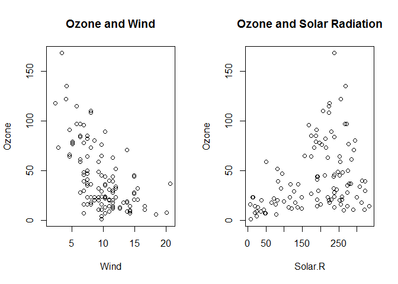
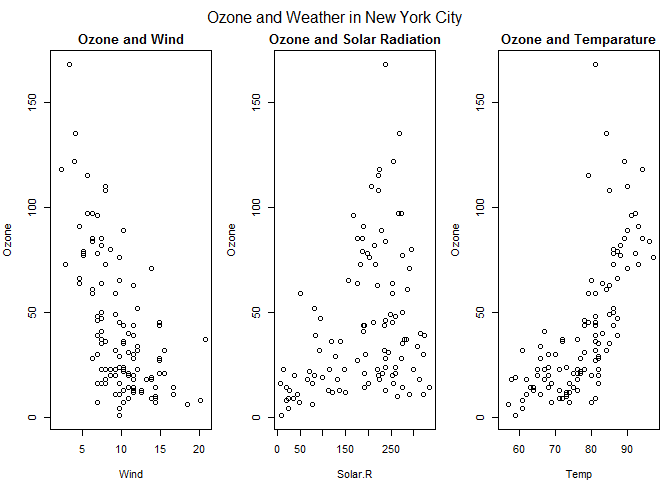
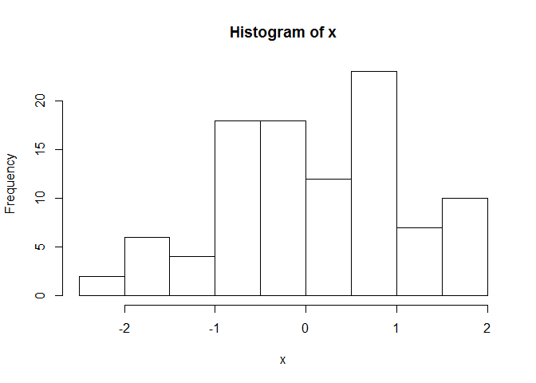
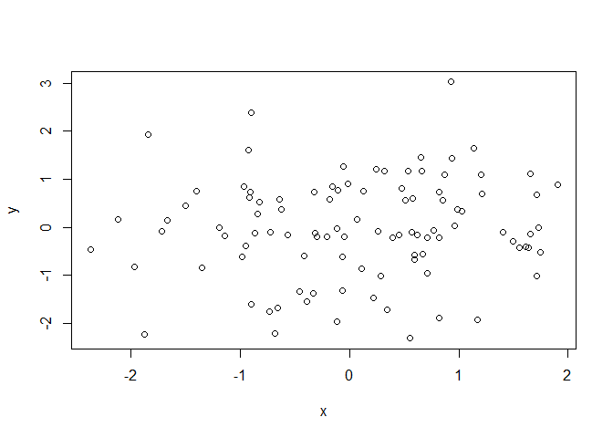
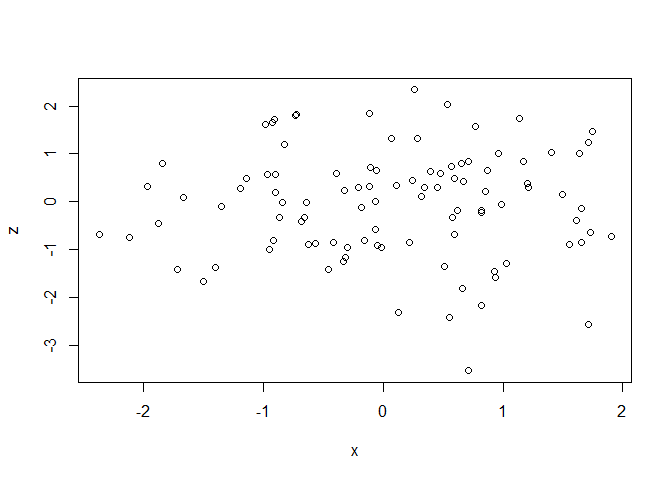
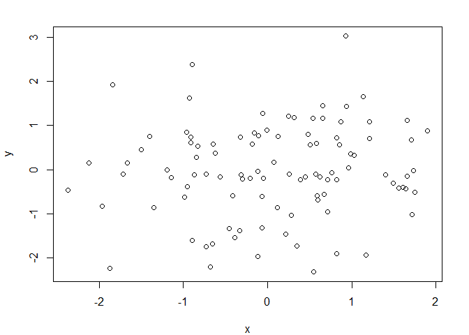
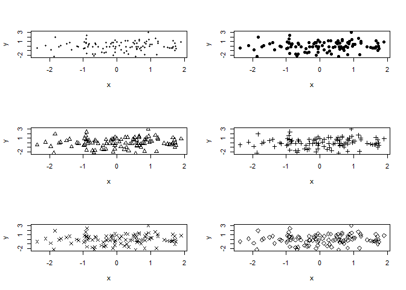
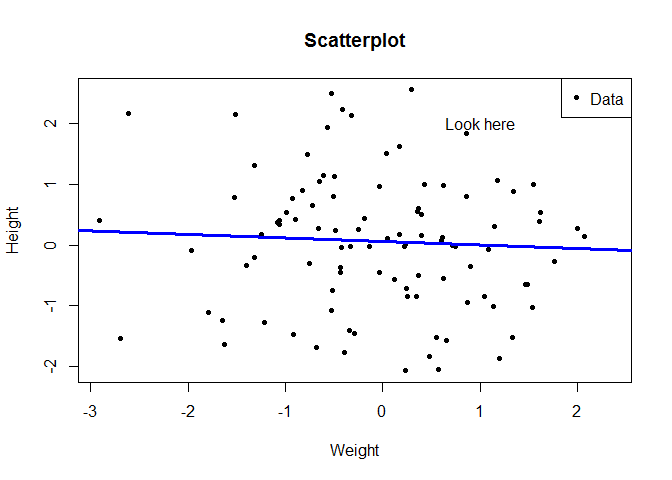
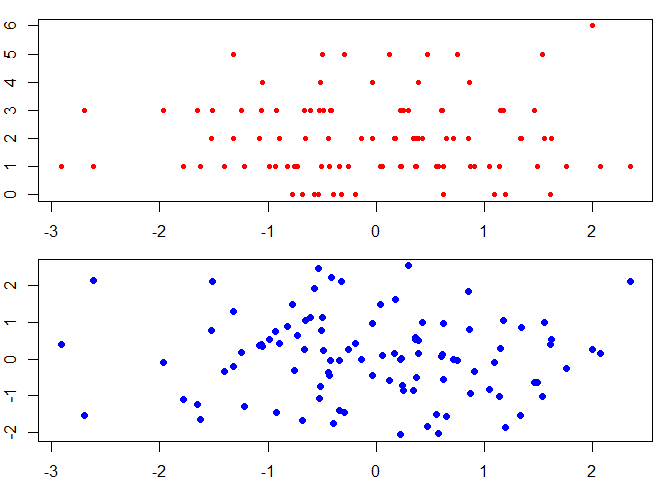
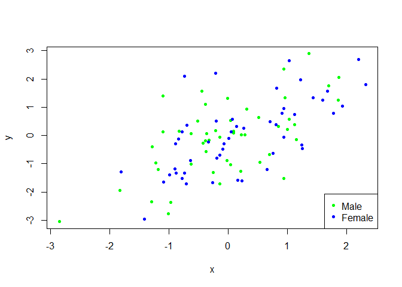

# Baseplot
#Part 1
***
##Simple Base Graphics: Histogram

```r
library(datasets)
hist(airquality$Ozone)  ## Draw a new plots
```

<!-- -->

##Simple Base Graphics: Scatterplot

```r
library(datasets)
with(airquality, plot(Wind,Ozone))
```

<!-- -->

##Simple Base Graphics: BoxPlot

```r
library(datasets)
airquality <- transform(airquality, Month=factor(Month))
boxplot(Ozone ~ Month, airquality, xlab="Month", ylab="Ozone (ppb")
```

<!-- -->

You can use some following key options:

* **pch**: the plotting symbol
* **lty**: the line type
* **lwd**: the line width
* **col**: the plotting color
* **xlab**: x-axis label
* **ylab**: y-axis label

##Some Import Base Graphics Parameters

* **las**: the orientation of axisi on labels on the plot
* **bg**: the background color
* **mar**: the margin size
* **oma**: the outer margin size (default is 0 for all sides)
* **mfrow**: the number of plots per row, column (plots are filled row-wise)
* **mfcol**: the number of plots per row, column (plots are filled column-wise)


```r
## To check the default value of the global graphics parameters user par() function with the parameter
```


```r
par('lty')
```

```
## [1] "solid"
```

```r
par('col')
```

```
## [1] "black"
```

```r
par('pch')
```

```
## [1] 1
```

```r
par('bg')
```

```
## [1] "white"
```

```r
par('mar')
```

```
## [1] 5.1 4.1 4.1 2.1
```

```r
par('mfrow')
```

```
## [1] 1 1
```
***

#Part 2
***
##Base Plotting Functions

* **plot**: make a scatterplot, or other type of plot dependding on the class of the object being plotted
* **lines**: add lines to a polot, given a vector x values and a corresponding vector of j values (or a 2 column matrix)
* **points**: add points to a plot
* **text**: add text labels to a plot using specified x, y coordinates
* **mtext**: add arbitrary text to the margins (inner or outer) of the plot
* **axis**: adding axis ticks/labels

##Base plot for Annotations

```r
library(datasets)
with(airquality, plot(Wind, Ozone))
title(main = "Ozone and Wind in New York City") ## Add a title
```

<!-- -->

>Another example

```r
library(datasets)
with(airquality, plot(Wind, Ozone, main="Ozone and Wind in New York City"))
with(subset(airquality, Month==5), points(Wind, Ozone, col="blue"))
```

<!-- -->


```r
library(datasets)
with(airquality, plot(Wind, Ozone, main="Ozone and Wind in New York City",type="n"))
with(subset(airquality, Month==5), points(Wind, Ozone, col="blue"))
with(subset(airquality, Month!=5), points(Wind, Ozone, col="red"))
legend("topright", pch=1, col=c("blue","red"), legend=c("May","Other Months"))
```

<!-- -->

**Note**: *type = n* tells the function not the draw the graph but just initialize.

##Base plot with Regression Line


```r
library(datasets)
with(airquality, plot(Wind, Ozone, main="Ozone and Wind in New York City",pch=20))
model <- lm(Ozone ~ Wind, airquality)
abline(model, lwd=2)
```

<!-- -->

##Multiple Base Plots

```r
library(datasets)
par(mfrow = c(1,2))
with(airquality, {
  plot(Wind, Ozone, main = "Ozone and Wind")
  plot(Solar.R, Ozone, main = "Ozone and Solar Radiation")
})
```

<!-- -->

>Another example


```r
library(datasets)
par(mfrow = c(1,3), mar=c(4,4,2,1), oma=c(0,0,2,0))
with(airquality,{
  plot(Wind, Ozone, main = "Ozone and Wind")
  plot(Solar.R, Ozone, main = "Ozone and Solar Radiation")
  plot(Temp, Ozone, main="Ozone and Temparature")
  mtext("Ozone and Weather in New York City", outer = TRUE)
})
```

<!-- -->

#Base Plot Demonstrations

```r
x <- rnorm(100)
hist(x)
```

<!-- -->


```r
y <- rnorm(100)
plot(x,y)
```

<!-- -->


```r
z <- rnorm(100)
plot(x,z)
```

<!-- -->

>Effect of margin adjustment
Shown here is the default margin

```r
plot(x,y)
```

<!-- -->

After adjusting margin

```r
par(mar = c(4,4,2,2))
plot(x,y)
```

<!-- -->

>Adjusting type of points

```r
par(mfrow=c(3,2))
plot(x,y, pch=20)
plot(x,y, pch=19)
plot(x,y, pch=2)
plot(x,y, pch=3)
plot(x,y, pch=4)
plot(x,y, pch=5)
```

<!-- -->

>More examples

```r
x <- rnorm(100)
y <- rnorm(100)
plot(x, y, pch=20, xlab="Weight",ylab= "Height")
title("Scatterplot")
text(1,2,"Look here")
legend("topright", legend = "Data", pch=20)

fit <- lm(y ~ x)
abline(fit, lwd=3, col='blue')
```

<!-- -->

> One more example


```r
par(mar=c(2,2,1,1))
z <- rpois(100,2)
par(mfrow=c(2, 1))
plot(x, z, pch=20, col='red')
plot(x, y, pch=19, col='blue')
```

<!-- -->

> Graphing on variable with relationship


```r
x <- rnorm(100)
y <- x + rnorm(100)
g <- gl(2, 50, labels = c("Male","Female"))
#Let's color male and female separately. 
#Let's first classify the data before it's drawn.
#For that let's initialize the drawing canvas but not draw the graph just yet.
plot(x, y, type='n')
points(x[g=="Male"],y[g=="Male"],col="green", pch=20)
points(x[g=="Female"],y[g=="Female"],col="blue", pch=20)
legend("bottomright", legend=c("Male","Female"),col=c('green','blue'), pch=20)
```

<!-- -->


#Part 3
***
##Graphical Devices in R

You can send the graphical output instead of window() to any other supported devices for example following code will send the output to the PDF


```r
pdf(file="myplot.pdf")

data("faithful")
with(faithful, plot(eruptions, waiting))
title(main="Old Faithful Geyser data")
dev.off()
```


Two basic types of file devices: *vector* and *bitmap* devices

Vector formats:

* **pdf** - ** Portable, well supported and not efficient if plot has many objects/points
* **svg** - XML based scalable vector graphics, supports animations and interactivity. Used for web based plots
* **win.metafile** - Windows metafile format (only on Windows)
* **postscript** - Older format, also resizes well, usuallly portable. Windows doesn's support it.


```r
## Follwoing code can show the current active device
dev.cur()

## You can switch to a different device by using the following command
dev.switch()
```

>Copy plot from one device to another

Example:

```r
library(datasets)
with(faitful, plot(eruptions, waiting))
title(main = "Old Faithful Geyser data")

#Copy the current output to a PNG file.
dev.copy(png, file="geyserplot.png")
dev.off()
```

