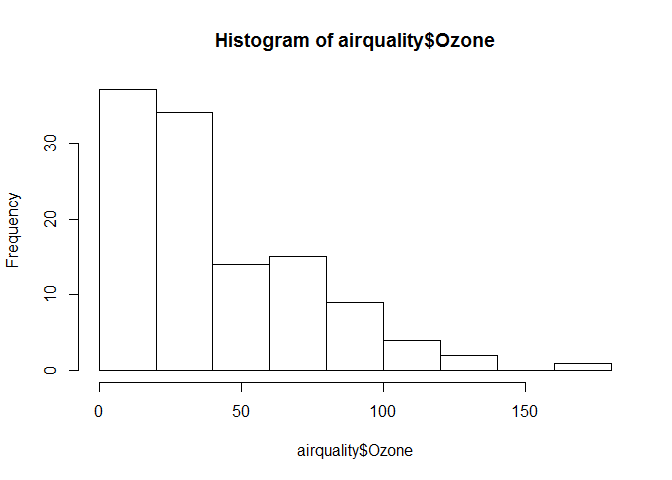
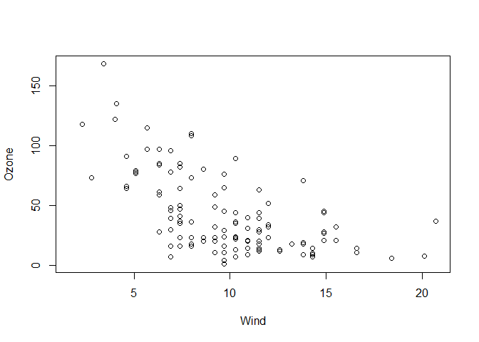
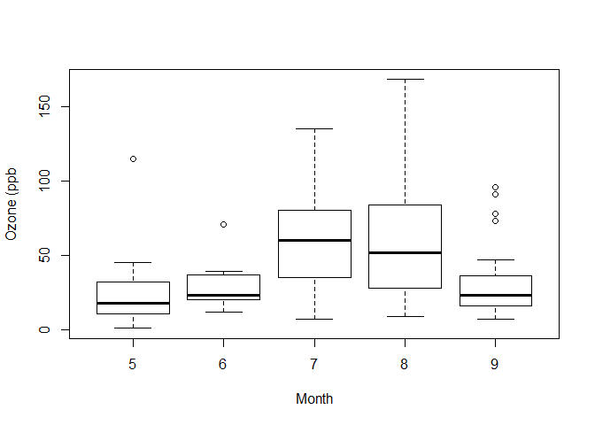
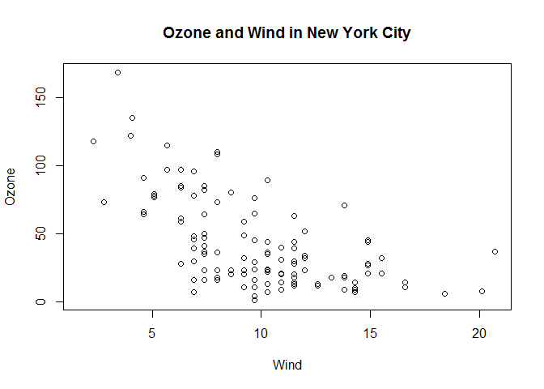
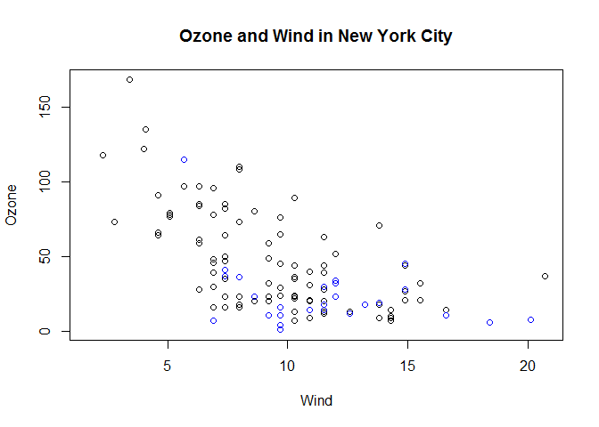
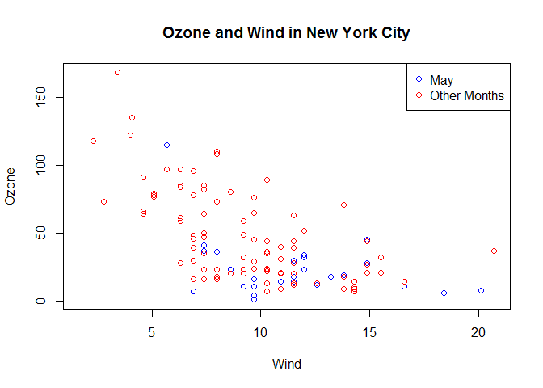
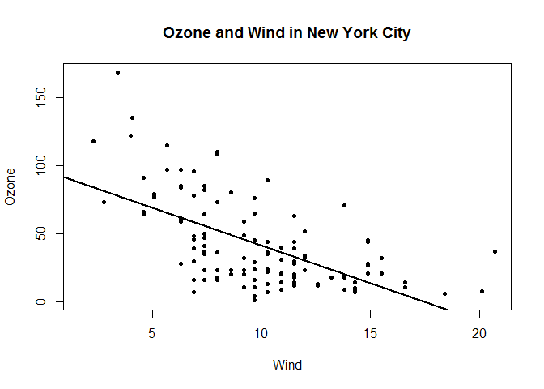

# Baseplot
Chandrasekar Ganesan  
February 24, 2017  
#Part 1

##Simple Base Graphics: Histogram

```r
library(datasets)
hist(airquality$Ozone)  ## Draw a new plots
```

<!-- -->

##Simple Base Graphics: Scatterplot

```r
library(datasets)
with(airquality, plot(Wind,Ozone))
```

<!-- -->

##Simple Base Graphics: BoxPlot

```r
library(datasets)
airquality <- transform(airquality, Month=factor(Month))
boxplot(Ozone ~ Month, airquality, xlab="Month", ylab="Ozone (ppb")
```

<!-- -->

You can use some following key options:

* **pch**: the plotting symbol
* **lty**: the line type
* **lwd**: the line width
* **col**: the plotting color
* **xlab**: x-axis label
* **ylab**: y-axis label

##Some Import Base Graphics Parameters

* **las**: the orientation of axisi on labels on the plot
* **bg**: the background color
* **mar**: the margin size
* **oma**: the outer margin size (default is 0 for all sides)
* **mfrow**: the number of plots per row, column (plots are filled row-wise)
* **mfcol**: the number of plots per row, column (plots are filled column-wise)


```r
## To check the default value of the global graphics parameters user par() function with the parameter
```


```r
par('lty')
```

```
## [1] "solid"
```

```r
par('col')
```

```
## [1] "black"
```

```r
par('pch')
```

```
## [1] 1
```

```r
par('bg')
```

```
## [1] "white"
```

```r
par('mar')
```

```
## [1] 5.1 4.1 4.1 2.1
```

```r
par('mfrow')
```

```
## [1] 1 1
```
***

#Part 2

##Base Plotting Functions

* **plot**: make a scatterplot, or other type of plot dependding on the class of the object being plotted
* **lines**: add lines to a polot, given a vector x values and a corresponding vector of j values (or a 2 column matrix)
* **points**: add points to a plot
* **text**: add text labels to a plot using specified x, y coordinates
* **mtext**: add arbitrary text to the margins (inner or outer) of the plot
* **axis**: adding axis ticks/labels

##Base plot for Annotations

```r
library(datasets)
with(airquality, plot(Wind, Ozone))
title(main = "Ozone and Wind in New York City") ## Add a title
```

<!-- -->

>Another example

```r
library(datasets)
with(airquality, plot(Wind, Ozone, main="Ozone and Wind in New York City"))
with(subset(airquality, Month==5), points(Wind, Ozone, col="blue"))
```

<!-- -->


```r
library(datasets)
with(airquality, plot(Wind, Ozone, main="Ozone and Wind in New York City",type="n"))
with(subset(airquality, Month==5), points(Wind, Ozone, col="blue"))
with(subset(airquality, Month!=5), points(Wind, Ozone, col="red"))
legend("topright", pch=1, col=c("blue","red"), legend=c("May","Other Months"))
```

<!-- -->

**Note**: *type = n* tells the function not the draw the graph but just initialize.

##Base plot with Regression Line


```r
library(datasets)
with(airquality, plot(Wind, Ozone, main="Ozone and Wind in New York City",pch=20))
model <- lm(Ozone ~ Wind, airquality)
abline(model, lwd=2)
```

<!-- -->

