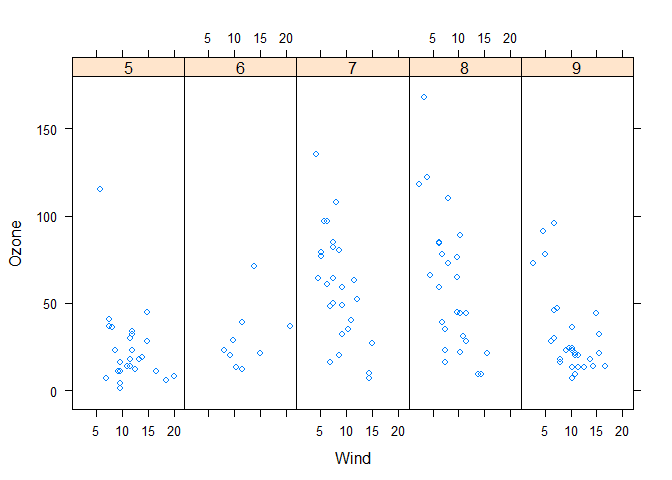
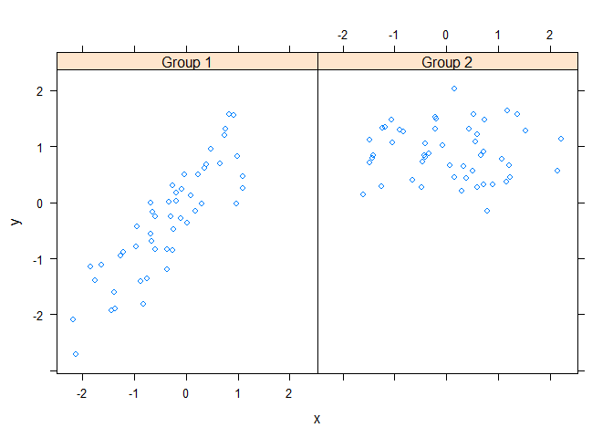
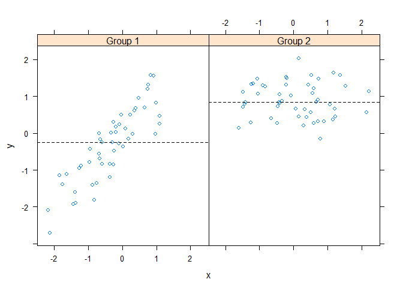
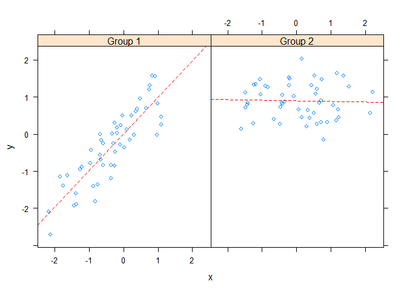
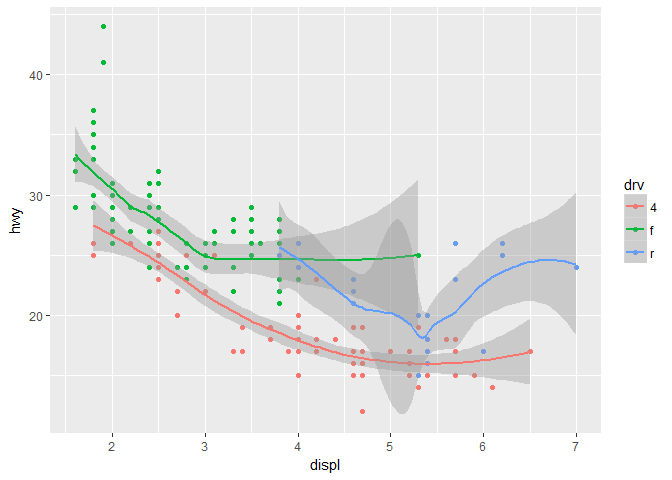
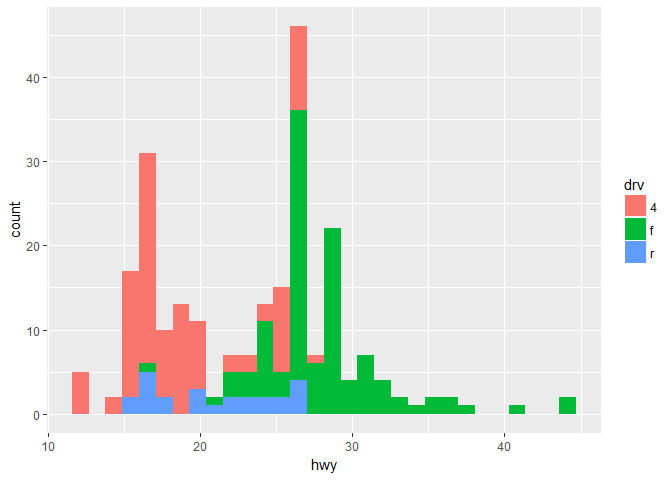
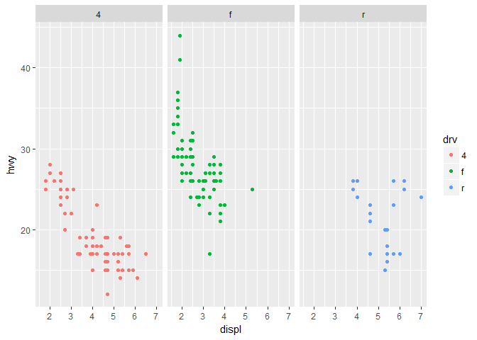
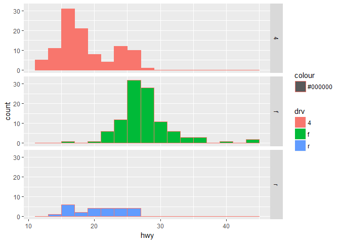

# Week 2 Notes


***
# Lattice Plots

## Lattice plotting system

Lattice plotting system is implemented using the following packages:

* ***lattice***: contains code for producing Trellis graphics, which are independent of the *"base"* graphics system; includes function like **xplot, bwplot, levelplot**

* ***grid***: implements a different graphing system independent of the *"base"* system; the *lattice* package builds on top of *grid*

  - We seldom call functions from the *grid* package directly
  
* The lattice plotting system does not have a "two-phase" aspect with separate plotting and annotations like in base plotting.

* All plotting/annotations is donoe at once with a single function call.

## Lattice Fuctions

### xyplot


```r
library(lattice)
library(datasets)
## Simple scatterplot

xyplot(Ozone ~ Wind, data = airquality)
```

<!-- -->

>Convert Month to a factor variable


```r
library(lattice)
library(datasets)
## Simple scatterplot
airquality <- transform(airquality, Month=factor(Month))
xyplot(Ozone ~ Wind | Month, data = airquality, layout=c(5,1))
```

<!-- -->

### Lattice Behavior

Lattice functions behave differently from the base graphics in one critical way

* Base grphics functions plot data directly to the graphics device (screen, PDF file, etc.)
* Lattice grphics functions return an object of class ***trellis***
* The print methods for lattice functions actuallly do the work of plotting the data on the graphics device.
* Lattice functions return "plot objects" that can, in principle, be stored (but it's usuallly better to just save the code + data)
* On the command line, trellis objects are *auto-printed* so that is appears the fucntion is plotting the data


```r
p <- xyplot(Ozone ~ Wind, data = airquality) ## Nothing happens
print(p) ## Plot appears
```

<!-- -->

> Auto-printing


```r
xyplot(Ozone ~ Wind, data = airquality) ## Auto printing
```

<!-- -->

***
### Lattice Panel Functions

* Lattice functions have a **panel function** which controls what happens inside each panel of the plot.
* The **lattice** package comes with defaul panel functions, but you can supply you won if you want to cuusotmize what happens in each panel.
* Panel functions recive the x/y coordinates of the data points in their panel (along with any optional arguments)

> Example - Default panels


```r
set.seed(10)
x <- rnorm(100)
f <- rep(0:1, each=50)
y <- x + f - f * x + rnorm(100, sd=0.5)
f <- factor(f, labels=c("Group 1","Group 2"))
xyplot(y ~ x | f, layout=c(2, 1)) ## Plot with 2 panels
```

<!-- -->

> Example - Customizing Panels


```r
set.seed(10)
x <- rnorm(100)
f <- rep(0:1, each=50)
y <- x + f - f * x + rnorm(100, sd=0.5)
f <- factor(f, labels=c("Group 1","Group 2"))
xyplot(y ~ x | f, panel = function(x, y, ...){
  panel.xyplot(x,y,...) # Call the default panel for XY Plot
  panel.abline(h = median(y), lty=2) ## Add a horizontal line at the median
}) ## Plot with 2 panels
```

<!-- -->

> Example - Let's add a regression line instead


```r
set.seed(10)
x <- rnorm(100)
f <- rep(0:1, each=50)
y <- x + f - f * x + rnorm(100, sd=0.5)
f <- factor(f, labels=c("Group 1","Group 2"))
xyplot(y ~ x | f, panel = function(x, y, ...){
  panel.xyplot(x,y,...) # Call the default panel for XY Plot
  panel.lmline(x,y, lty=2, col='red') ## Add a horizontal line at the median
}) ## Plot with 2 panels
```

<!-- -->

***

# GGPLot2 - ggplot2 

## ggplot2 Plotting System - http://ggplot2.org

***Grammar of Grapics - ggplots Defintion***

"In breif, the grammer tells us that a statistical graphic is a **mapping** from data to **aesthetic** attributes (colour, shape, size) of **geometric** objects (points, lines, bars). The plot may also contain statistical transformations of the data and is drawn on a specific coordinate system"

*from ggplot2 book*

### Basic Components of a ggplot2 Plot

* A **data frame**

* **aesthetics mappings**: how data are mapped to color, size

* **goems**: geometrics objects like points, lines, shapes

* **facets**: for conditional plots

* **stats**: statistical transformations like binning, quantiles, smoothing

* **scales**: what scales an aesthetic map uses (example: male=red, female=blue)

* **coordinate system**

### Building Plots with ggplot2

* When building plots in ggplot2 (rather than using qplot) the "*artists's palette*" model may be closest analogy

* Plots are built up in laters
+ Plot the data
+ Overlay a summary
+ Metadata and annotation

### The Basic: qplot()

* Works much like the plot function in base graphics system

* Looks for data in a data frame, similar to lattice, or in the parent environment

* Plots are made up of aesthetics (size, shape and color) and geoms (points, lines)

* Factors are important for indicating the subsets of the data (if they are to have different properties); they should be labeled

* The qplot() hides what goes on underneath which is okay for most operations

* ggplot() is the core function and very flexible for doing things qplot() cannot do

### Example Dataset


```r
library(ggplot2)
str(mpg)
```

```
## Classes 'tbl_df', 'tbl' and 'data.frame':	234 obs. of  11 variables:
##  $ manufacturer: chr  "audi" "audi" "audi" "audi" ...
##  $ model       : chr  "a4" "a4" "a4" "a4" ...
##  $ displ       : num  1.8 1.8 2 2 2.8 2.8 3.1 1.8 1.8 2 ...
##  $ year        : int  1999 1999 2008 2008 1999 1999 2008 1999 1999 2008 ...
##  $ cyl         : int  4 4 4 4 6 6 6 4 4 4 ...
##  $ trans       : chr  "auto(l5)" "manual(m5)" "manual(m6)" "auto(av)" ...
##  $ drv         : chr  "f" "f" "f" "f" ...
##  $ cty         : int  18 21 20 21 16 18 18 18 16 20 ...
##  $ hwy         : int  29 29 31 30 26 26 27 26 25 28 ...
##  $ fl          : chr  "p" "p" "p" "p" ...
##  $ class       : chr  "compact" "compact" "compact" "compact" ...
```

> ggplot "Hello, world !"


```r
library(ggplot2)
qplot(displ, hwy, data=mpg)
```

<!-- -->

> Modity aesthetics


```r
library(ggplot2)
qplot(displ, hwy, data=mpg, color=drv)
```

<!-- -->

>Add a geom


```r
library(ggplot2)
qplot(displ, hwy, data=mpg, geom=c("point","smooth"))
```

```
## `geom_smooth()` using method = 'loess'
```

<!-- -->


>Add a geom by a factor variable


```r
library(ggplot2)
qplot(displ, hwy, data=mpg, color = drv, geom=c("point","smooth"))
```

```
## `geom_smooth()` using method = 'loess'
```

<!-- -->

### Histograms

Generate Histogram by specific only one variable.


```r
qplot(hwy, data=mpg, fill=drv)
```

```
## `stat_bin()` using `bins = 30`. Pick better value with `binwidth`.
```

<!-- -->

### Facets (equivalent to Panels in Lattice)

> qplot


```r
qplot(displ, hwy, data=mpg, facets = . ~ drv, colour = drv)
```

<!-- -->

> Histogram


```r
qplot(hwy, data=mpg, facets = drv ~ ., binwidth=2, colour='#000000', fill=drv)
```

<!-- -->

#### 
