# README
Chandrasekar Ganesan  
March 2, 2017  


# Hierarchical Clustering - Example

```r
set.seed(1234)
par(mar=c(0,0,0,0))
x <- rnorm(12, mean=rep(1:3, each=4), sd=0.2)
y <- rnorm(12, mean=rep(1,2,1, each=4), sd=0.2)
plot(x, y, col='blue', pch=19, cex=2)
text(x + 0.05, y + 0.05, labels(as.character(1:12)))
```

<!-- -->

>Hierarchical Clusterring - Dist

```r
dataFrame <- data.frame(x = x, y = y)
dist(dataFrame)
```

```
##             1          2          3          4          5          6
## 2  0.34120511                                                       
## 3  0.57493739 0.24102750                                            
## 4  0.26381786 0.52578819 0.71861759                                 
## 5  1.32829783 1.03674741 0.91735828 1.55702849                      
## 6  1.34289555 1.06377512 0.96021156 1.57849918 0.08150268           
## 7  1.12653104 0.84893905 0.75865878 1.36197257 0.21110433 0.21666557
## 8  1.29969142 0.95848707 0.73404628 1.45063548 0.61704200 0.69791931
## 9  2.13629539 1.83167669 1.67835968 2.35675598 0.81160529 0.81322878
## 10 2.06419586 1.76999236 1.63109790 2.29239480 0.73617872 0.72567124
## 11 2.14702468 1.85183204 1.71074417 2.37461984 0.81885779 0.80884612
## 12 2.05664233 1.74662555 1.58658782 2.27232243 0.74039824 0.75094539
##             7          8          9         10         11
## 2                                                        
## 3                                                        
## 4                                                        
## 5                                                        
## 6                                                        
## 7                                                        
## 8  0.65062566                                            
## 9  1.02071213 1.09596506                                 
## 10 0.93949958 1.09784758 0.14090406                      
## 11 1.02259080 1.16375491 0.11624471 0.08317570           
## 12 0.95130649 0.99022086 0.10848966 0.19128645 0.20802789
```

>Hierarchical Clustering- hclust

```r
distxy <- dist(dataFrame)
hClustering <- hclust(distxy)
#dendograms
plot(hClustering)
```

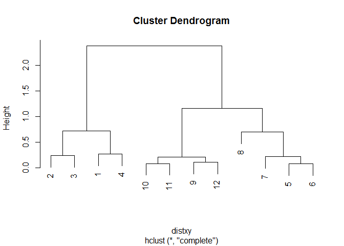<!-- -->

>Headmap

```r
dataFrame <- data.frame(x = x, y = y)
set.seed(143)
dataMatrix <- as.matrix(dataFrame)[sample(1:12),]
heatmap(dataMatrix)
```

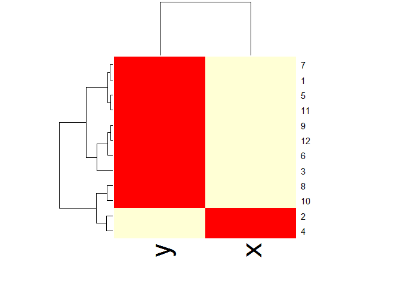<!-- -->

## K-Means Clustering & Dimension Reduction

### K-means clustering

How do we define *close*?

#### Most important step
  + garbage in -> garbage out

#### Distance or similarity
  + Continuous - euclidean distance
  + Continuous - correlation similarity
  + Binary - manhattan distance
  + Pick a distance / similarity that makes sense for your problem

#### A partitioning approach
  + Fix a number of clusters
  + Get "centroids" of each cluster
  + Assign things to closest centroid
  + Recalculate centroids
  
#### Requires
  + A defined distance metric
  + A number of clusters
  + An initial guess as of cluster centroids
  
#### Produces
  + Final estimate of cluster centroids
  + An assignment of each point of clusters
  
  
> K-means Clustering - Example


```r
set.seed(1234)
par(mar=c(0,0,0,0))
x <- rnorm(12, mean=rep(1:3, each=4), sd=0.2)
y <- rnorm(12, mean=rep(1,2,1, each=4), sd=0.2)
plot(x, y, col='blue', pch=19, cex=2)
text(x + 0.05, y + 0.05, labels=as.character(1:12))
```

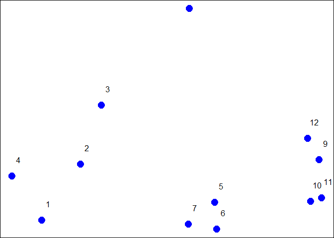<!-- -->

#### K-means()

* Important paraments: x, centers, iter.max, nstart


```r
dataFrame <- data.frame(x, y)
kmeansObj <- kmeans(dataFrame, centers=3)
names(kmeansObj)
```

```
## [1] "cluster"      "centers"      "totss"        "withinss"    
## [5] "tot.withinss" "betweenss"    "size"         "iter"        
## [9] "ifault"
```

```r
kmeansObj$cluster
```

```
##  [1] 3 3 3 3 1 1 1 1 2 2 2 2
```

```r
#K-means()
par(mar = rep(0.2, 4))
plot(x, y, col = kmeansObj$cluster, pch=19, cex = 2)
points(kmeansObj$centers, col=1:3, pch=3, cex=2)
```

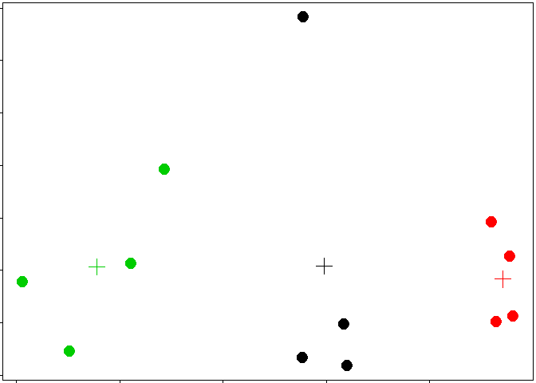<!-- -->

#### Heatmaps


```r
set.seed(1234)
dataMatrix <- as.matrix(dataFrame)[sample(1:12),]
kmeansObj2 <- kmeans(dataMatrix, centers= 3)
par(mfrow = c(1,2), mar = c(1,4,0.1,0.1))
image(t(dataMatrix)[, nrow(dataMatrix):1], yaxt = "n")
image(t(dataMatrix)[, order(kmeansObj$cluster)], yaxt = "n")
```

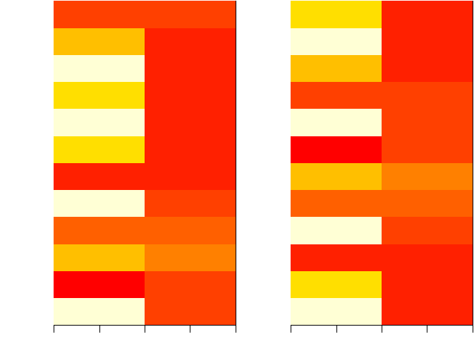<!-- -->

### Dimension Reduction
> Let's generates a Matrix data and plot as image


```r
# A Random Matrix Plot
set.seed(1234)
par(mar=rep(0.2, 4))
dataMatrix <- matrix(rnorm(400), nrow=40)
image(1:10, 1:40, t(dataMatrix)[, nrow(dataMatrix):1])
```

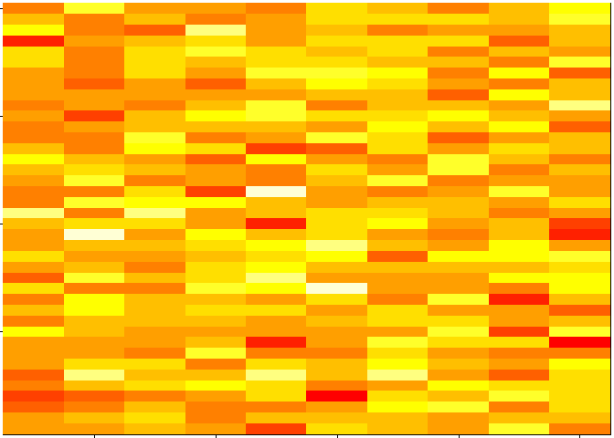<!-- -->

> Cluster the data


```r
par(mar = rep(0.2, 4))
heatmap(dataMatrix)
```

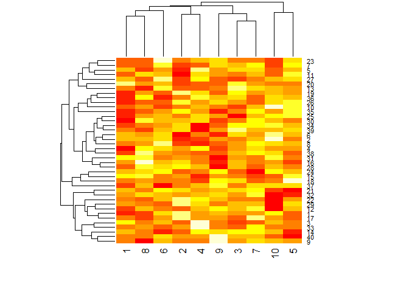<!-- -->

```r
# Observe there is no interesting pattern to the data
```

> What if we add a pattern ?


```r
set.seed(678910)
for(i in 1:40){
  # flip a coin
  coinFlip <- rbinom(1, size=1, prob=0.5)
  #if the coin is head adda common pattern to that row
  if (coinFlip){
    dataMatrix[i, ] <- dataMatrix[i, ] + rep(c(0,3), each=5)
  }
}
par(mar = rep(0.2, 4))
image(1:10, 1:40, t(dataMatrix)[, nrow(dataMatrix):1])
```

<!-- -->

> Run the heatmap again


```r
par(mar = rep(0.2, 4))
heatmap(dataMatrix)
```

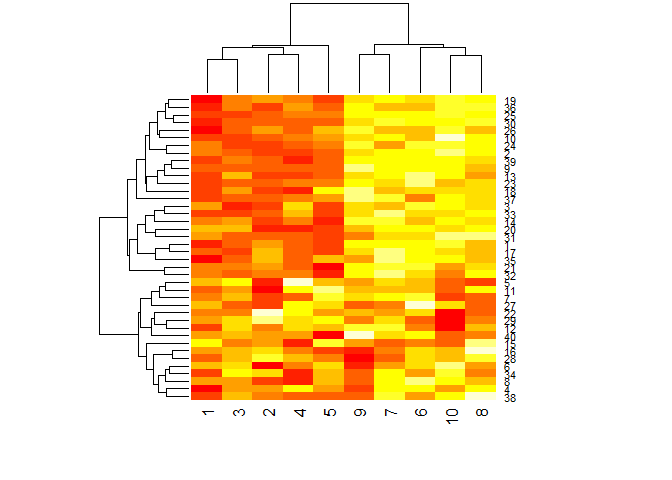<!-- -->

> Patterns in rows and columns


```r
hh <- hclust(dist(dataMatrix))
dataMatrixOrdered <- dataMatrix[hh$order,]
par(mfrow=c(1,3))
image(t(dataMatrixOrdered)[, nrow(dataMatrixOrdered):1])
plot(rowMeans(dataMatrixOrdered), 40:1,xlab="Row Mean", ylab="Row", pch=19)
plot(colMeans(dataMatrixOrdered),xlab="Column", ylab="Column Mean", pch=19)
```

<!-- -->

***

### **Related Problems**

You have multivariate variables *X1*,....,*Xn* so *X1* = (*X^11^*,.......*X^1m^*)

* Find a new set of multivariate variables that are uncorrelated and explain as much variance as possible.
* If you put all the variables in one matrix, find the best matrix created with fewer variables (lower rank) that explains the original data

The first goal is **statistical** and the second goal is **data compression**.

#### **Related Solution**

**SVD - Singular Value Decomposition**

If *X* is a matrix with each variable in a column and each observation in a row then the SVD is a "matrix decomposition"

                    X = *UVD^T^*
                    
where the columns of *U* are the orthogonal (left singular vectors), the columns of *V* are orthogonal (right singular vector) and *D* is a diagonal vector matrix (singular values)

** PCA - Principal components analysis **

The principal components are equal to the right singular values if you first scale (subtract the mean, divide by the standard deviation) of the variables.


### Components of the SVD - *u* and *v*


```r
svd1 <- svd(scale(dataMatrixOrdered))
par(mfrow = c(1,3))
image(t(dataMatrixOrdered)[, nrow(dataMatrixOrdered):1])
plot(svd1$u[,1], 40:1, xlab="Row", ylab="First Left Singular vector", pch=19)
plot(svd1$v[,1], xlab="Column", ylab="First Right Singular vector", pch=19)
```

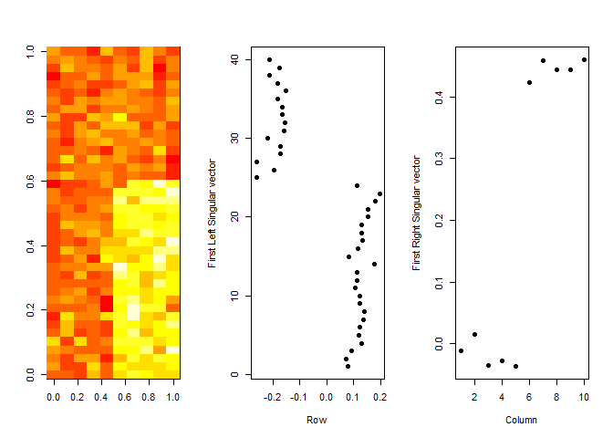<!-- -->

### Components of the SVD - Variance explained


```r
par(mfrow=c(1,2))
plot(svd1$d, xlab="Column",ylab="Singular Value", pch=19)
plot(svd1$d^2/sum(svd1$d^2), xlab="Column", ylab="Prop. of Variance explained", pch=19)
```

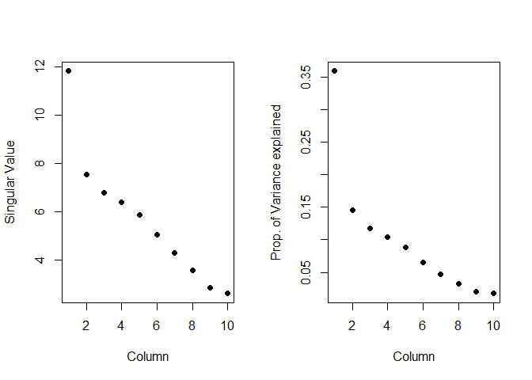<!-- -->

### Relationship to principal components


```r
svd1 <- svd(scale(dataMatrixOrdered))
pca1 <- prcomp(dataMatrixOrdered, scale = TRUE)
plot(pca1$rotation[,1], svd1$v[,1], pch=19, xlab="Principal Component 1", ylab="Right Singular Vector 1")
abline(c(0,1))
```

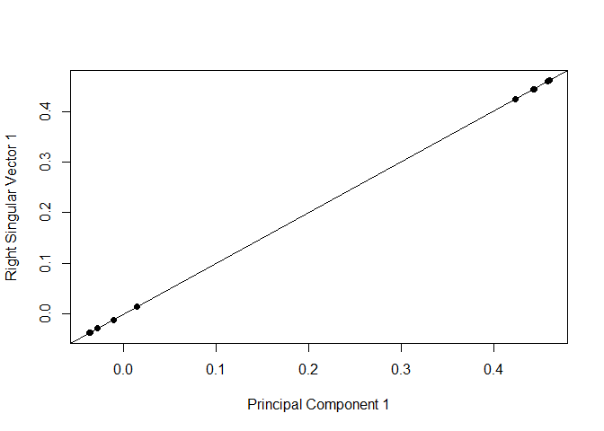<!-- -->

### Components of the SVD - variance explained


```r
constantMatix <- dataMatrixOrdered * 0
for (i in 1 : dim(dataMatrixOrdered)[1]){
  constantMatix[i,] <- rep(c(0,1),each=5)
  }
  
svd1 <- svd(constantMatix)
par(mfrow=c(1,3))

image(t(constantMatix)[,nrow(constantMatix):1])
plot(svd1$d, xlab="Column", ylab="Singular Value", pch=19)
plot(svd1$d^2/sum(svd1$d^2), xlab="Column", ylab="Prop. of variance explained", pch=19)
```

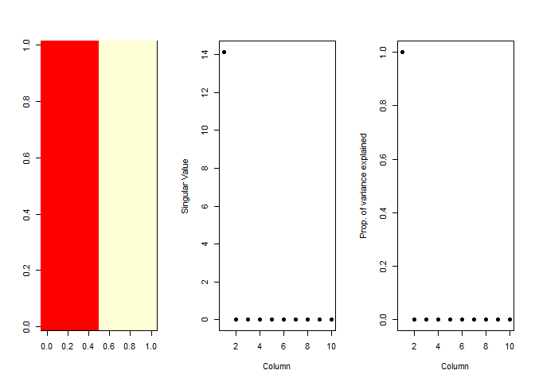<!-- -->

### What if we add a second pattern?


```r
set.seed(678910)
for (i in 1:40){
  #flipe a coin
  coinflip1 <- rbinom(1, size=1, prob=0.5)
  coinflip2 <- rbinom(1, size=1, prob=0.5)
  
  if (coinflip1){
    dataMatrix[i,] <- dataMatrix[i,] + rep(c(0,5), each=5)
  }
  if (coinflip1){
    dataMatrix[i,] <- dataMatrix[i,] + rep(c(0,5), each=5)
  }
}

hh <- hclust(dist(dataMatrix))
dataMatrixOrdered <- dataMatrix[hh$order,]
```

> Singular Value decomposition - true patterns


```r
## Let's plot it

svd2 <- svd(scale(dataMatrixOrdered))
par(mfrow=c(1,3))
image(t(dataMatrixOrdered)[, nrow(dataMatrixOrdered):1])
plot(rep(c(0,1), each=5),pch=19, xlab="Column", ylab="Pattern 1")
plot(rep(c(0,1), 5),pch=19, xlab="Column", ylab="Pattern 2")
```

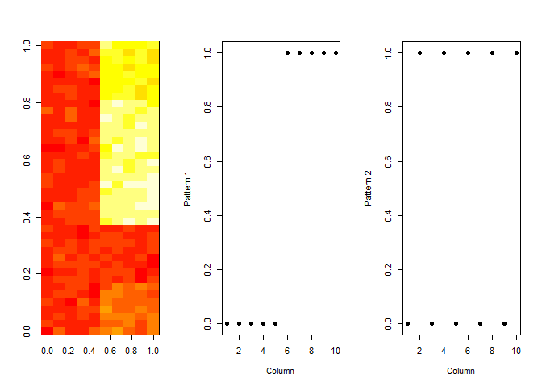<!-- -->

> v and patterns of varinace in rows


```r
## Let's plot it

svd2 <- svd(scale(dataMatrixOrdered))
par(mfrow=c(1,3))
image(t(dataMatrixOrdered)[, nrow(dataMatrixOrdered):1])
plot(svd2$v[, 1],pch=19, xlab="Column", ylab="First right singular vector")
plot(svd2$v[, 2],pch=19, xlab="Column", ylab="Second right singular vector")
```

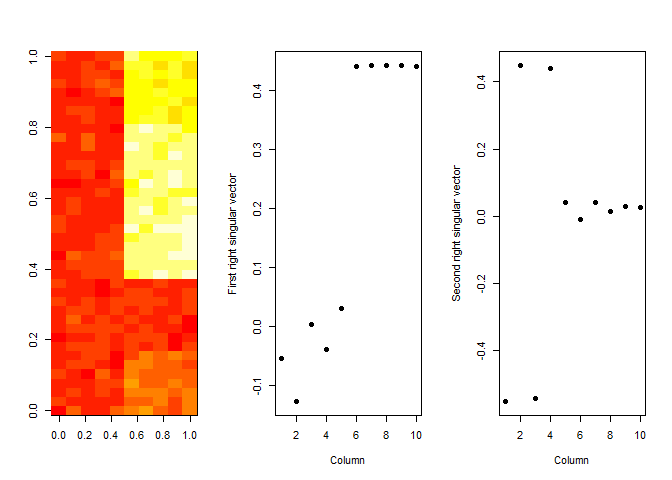<!-- -->

> d and variance explained


```r
svd1 <- svd(scale(dataMatrixOrdered))
par(mfrow = c(1,2))
plot(svd1$d, xlab="Column", ylab= "Singular Value", pch=19)
plot(svd1$d^2/sum(svd1$d^2), xlab="Column", ylab= "Percentage of variance explained", pch=19)
```

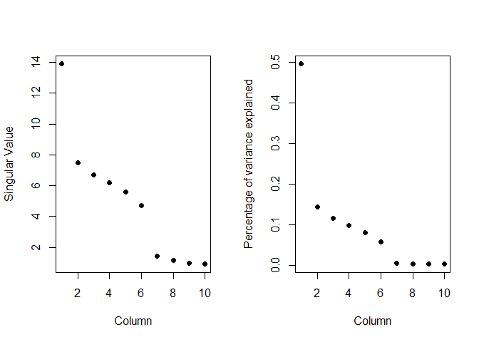<!-- -->

## Missing Values

Always deal with missing values before running *SVD* or *PCA* analysis.

### Imputing {impute}


```r
library(impute) #Available from https://bioconductor.org #biocLite
dataMatrix2 <- dataMatrixOrdered
dataMatrix2[sample(1:100, size=40, replace=FALSE)] <- NA
dataMatrix2 <- impute.knn(dataMatrix2)$data
svd1 <- svd(scale(dataMatrixOrdered))
svd2 <- svd(scale(dataMatrix2))

par(mfrow = c(1,2))
plot(svd1$v[,1], pch=19)
plot(svd2$v[,1], pch=19)
```

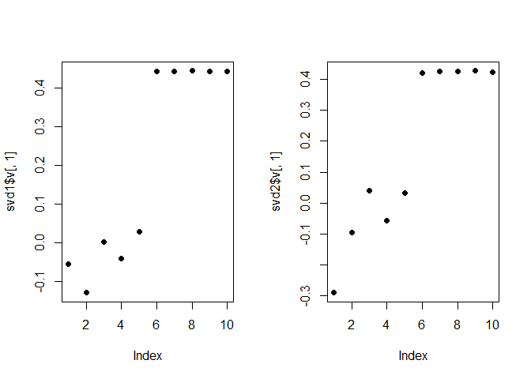<!-- -->

# Plotting and Color in R

**Color Utilities in R**  

* The **grDevices** pacckage has two functions
  - colorRamp
  - colorRampPalette
  
* These function take palettes of colors and help to interpolate between the colors

* The function colors() lists the names of colors you can use in any plotting function

* colorRamp: Take a palette of colors and return a function that takes a value between 0 annd 1, indicating the extremes of the color palette (e.g. see the 'gray' function)

* colorRampPalette: Take a palette of colors and return a funcction that takes integer arguments and returns a vector of colors interpolating the palette (like head.colors or topo.colors)

> Example


```r
pal <- colorRamp(c("red","blue"))
pal(0)
```

```
##      [,1] [,2] [,3]
## [1,]  255    0    0
```

```r
pal(1)
```

```
##      [,1] [,2] [,3]
## [1,]    0    0  255
```

```r
pal(0.5)
```

```
##       [,1] [,2]  [,3]
## [1,] 127.5    0 127.5
```

> Another Example


```r
pal(seq(0,1,len=10))
```

```
##            [,1] [,2]      [,3]
##  [1,] 255.00000    0   0.00000
##  [2,] 226.66667    0  28.33333
##  [3,] 198.33333    0  56.66667
##  [4,] 170.00000    0  85.00000
##  [5,] 141.66667    0 113.33333
##  [6,] 113.33333    0 141.66667
##  [7,]  85.00000    0 170.00000
##  [8,]  56.66667    0 198.33333
##  [9,]  28.33333    0 226.66667
## [10,]   0.00000    0 255.00000
```

> **colorRampPalette** on the other hand will return the hex color value


```r
pal <- colorRampPalette(c("red","yellow"))

pal(2)
```

```
## [1] "#FF0000" "#FFFF00"
```

```r
pal(10)
```

```
##  [1] "#FF0000" "#FF1C00" "#FF3800" "#FF5500" "#FF7100" "#FF8D00" "#FFAA00"
##  [8] "#FFC600" "#FFE200" "#FFFF00"
```

<<<<<<< HEAD
## RColorBrewer Package

* One package on CRAN that contains interesting/useful color palettes

* There are 3 types of palettes

 - Sequential   - They go in specific order
 - Diverging    - Used to show ranges (e.g., negative to positive)
 - Qualitative  - Used for classification
 
* Palette information can be used in conjunction with the colorRamp() and colorRampPalette()

> **Example**


```r
library(RColorBrewer)
cols <- brewer.pal(3, "BuGn")
cols
```

```
## [1] "#E5F5F9" "#99D8C9" "#2CA25F"
```

```r
pals <- colorRampPalette(cols)
image(volcano, col=pals(20))
```

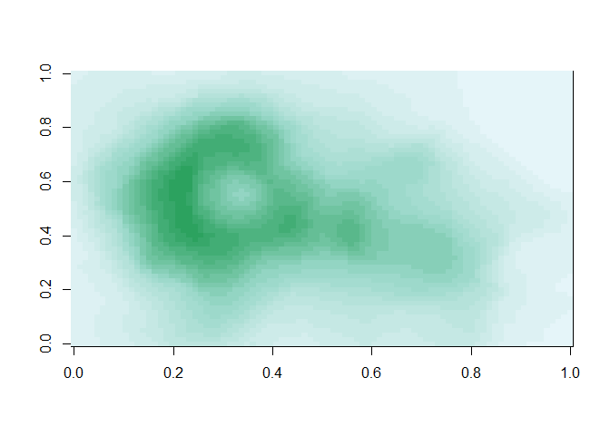<!-- -->

> Another Example **The smoothScatter function**


```r
x <- rnorm(10000)
y <- rnorm(10000)
smoothScatter(x,y)
```

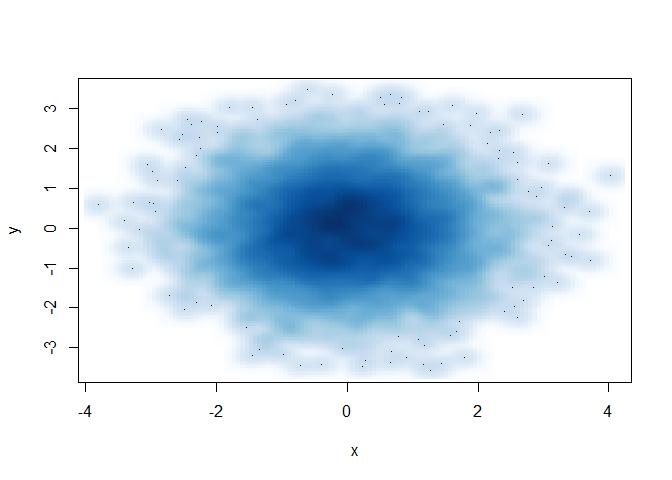<!-- -->

### Some other plotting notes

* The rgb function can be used to produce any color via red, greeb and blue proportions

* Color transparency can be added via the alpha parameter to rgb

* the **colorspace** package can be used for a different control over colors


=======
>>>>>>> bfa45873437bcd0c99d5bf9e1b172bc1d489f5d7


